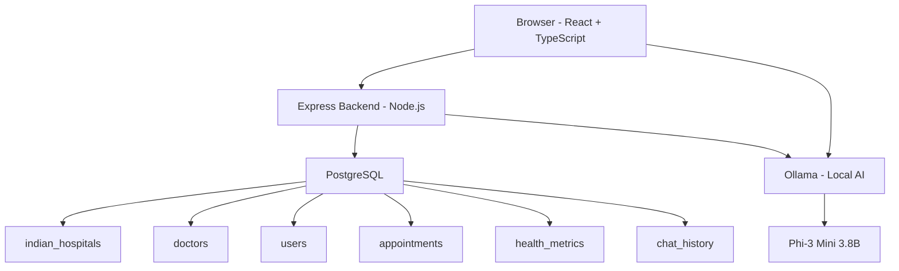

# Healthcare+

[](https://health-care-plus-kappa.vercel.app)

> AI-powered healthcare platform connecting patients to real Indian hospitals, doctors, and medical guidance — with a local AI assistant that runs entirely on your device.

[](https://www.typescriptlang.org/)
[](https://reactjs.org/)
[](https://nodejs.org/)
[](https://postgresql.org/)
[](LICENSE)

---

## What This Is

Healthcare+ is a full-stack web application built to address a real problem: most healthcare platforms in India either use mock data or are designed for Western healthcare systems.

This platform uses real Indian hospital and doctor data, an AI assistant powered by Ollama running locally on the user's device (so no medical data ever leaves the machine), and an interactive map for finding hospitals by city.

**Current status:** Active development. Core features working. Appointment booking and health metrics dashboard in progress.

---

## Features

### Working Now

- **Hospital Locator** — Search real Indian hospitals by city. Results include bed count, emergency availability, Ayushman Bharat status, phone numbers, and map coordinates.
- **Interactive Map** — Leaflet + OpenStreetMap renders hospital markers with real coordinates across India.
- **AI Chat Assistant** — Powered by Ollama + Phi-3 Mini (3.8B parameters) running locally. Answers medical questions with Indian healthcare context. Zero data sent to external servers.
- **Doctor Directory** — 15+ verified Indian specialists with qualifications, consultation fees, languages spoken, and hospital affiliations.
- **Authentication** — JWT-based login and registration with bcrypt password hashing.
- **Dark/Light Mode** — System-level theme support via Tailwind CSS.

### In Progress

- Appointment booking end-to-end flow
- Health metrics dashboard with personal tracking
- Emergency one-click response with location sharing

---

## Architecture



The frontend talks to the Express backend for all data. For AI, it first tries the backend proxy, then falls back to a direct local Ollama call. The AI model runs entirely on the user's machine — no medical data is sent to any cloud service.

---

## Tech Stack

| Layer | Technology | Purpose |
|-------|-----------|---------|
| Frontend | React 18 + TypeScript | UI framework with type safety |
| Styling | Tailwind CSS | Utility-first, dark mode built in |
| Routing | React Router v6 | Client-side navigation |
| Maps | Leaflet + OpenStreetMap | Free maps, works in India |
| Icons | Lucide React | Consistent icon set |
| Backend | Node.js + Express | REST API server |
| Database | PostgreSQL 15 | Primary data store |
| Auth | JWT + bcrypt | Authentication |
| AI | Ollama + Phi-3 Mini | Local language model |
| Build | Vite | Frontend bundler |

---

## Local Setup

### Prerequisites

- Node.js 18+
- PostgreSQL 15+
- Ollama (for AI features)

### Steps

```bash
# 1. Clone the repo
git clone https://github.com/devenmundada/HealthCare-PLUS.git
cd HealthCare-PLUS

# 2. Install all dependencies
npm install
cd frontend && npm install
cd ../backend && npm install

# 3. Set up environment variables
cp backend/.env.example backend/.env
# Edit backend/.env with your PostgreSQL credentials and JWT secret

# 4. Set up the database
cd backend
node scripts/migrate.js
node scripts/seed.js

# 5. Install and start Ollama (for AI features)
# Download from https://ollama.com
ollama pull phi3:mini
ollama serve

# 6. Start everything
# Terminal 1 - Backend
cd backend && npm run dev

# Terminal 2 - Frontend
cd frontend && npm run dev
```

Frontend runs at http://localhost:5173
Backend runs at http://localhost:3001
Ollama runs at http://localhost:11434

---

## API Reference

| Method | Endpoint | Auth | Description |
|--------|----------|:----:|-------------|
| POST | `/api/auth/signup` | No | Register new user |
| POST | `/api/auth/login` | No | Login, returns JWT |
| GET | `/api/auth/me` | Yes | Get current user |
| GET | `/api/india/hospitals/city/:city` | No | Hospitals by city |
| GET | `/api/india/hospitals/search` | No | Search hospitals |
| GET | `/api/doctors` | No | List doctors with filters |
| GET | `/api/doctors/specialties` | No | All specialties |
| POST | `/api/ai/chat` | No | Send message to AI |
| GET | `/api/ai/status` | No | Check if Ollama is running |
| POST | `/api/health/metrics` | Yes | Save health metric |
| GET | `/api/health/metrics` | Yes | Get user metrics |
| POST | `/api/appointments` | Yes | Book appointment |
| GET | `/api/appointments/user` | Yes | Get user appointments |

Full details in [docs/api-reference.md](docs/api-reference.md)

---

## Database Schema

9 tables: `users`, `health_profiles`, `indian_hospitals`, `doctors`, `appointments`, `health_metrics`, `notifications`, `chat_history`, `weather_cache`

Full schema in [docs/database.md](docs/database.md)

---

## AI Integration

The AI assistant uses Ollama with the Phi-3 Mini model (3.8B parameters). It runs locally on the user's device. When the user sends a message:

1. Frontend sends message to backend proxy
2. Backend forwards to local Ollama instance
3. Ollama runs Phi-3 Mini inference
4. Response is returned with Indian healthcare context

If Ollama is not running, the backend returns a graceful fallback message.

**Why local AI?** Medical queries are sensitive. Running the model locally means no patient data is sent to OpenAI, Google, or any third party. It also means no per-query API costs.

Full details in [docs/ai-integration.md](docs/ai-integration.md)

---

## Roadmap

See [docs/roadmap.md](docs/roadmap.md) for the full plan. Short version:

- **Next:** Complete appointment booking, health metrics dashboard, emergency response
- **3 months:** Telemedicine video calls, digital health records, medicine delivery integration
- **6 months:** Medical image analysis (X-ray, skin conditions), multi-language support (Hindi, Tamil, Telugu), voice interface
- **12 months:** Mobile app (React Native), 500+ hospitals, 500+ doctors

---

## Documentation

| File | Contents |
|------|----------|
| [docs/architecture.md](docs/architecture.md) | System design and component breakdown |
| [docs/api-reference.md](docs/api-reference.md) | All endpoints with request/response examples |
| [docs/database.md](docs/database.md) | Full PostgreSQL schema |
| [docs/ai-integration.md](docs/ai-integration.md) | Ollama setup and prompt engineering |
| [docs/security.md](docs/security.md) | Auth, encryption, and data privacy |
| [docs/deployment.md](docs/deployment.md) | Production deployment guide |
| [docs/roadmap.md](docs/roadmap.md) | Feature roadmap by phase |

---

## Author

**Deven Mundada**

[](https://github.com/devenmundada)
[](https://linkedin.com/in/devenmundada)

---

## License

MIT License. See [LICENSE](LICENSE) for details.

---

## Live Links

| | URL |
|--|-----|
| **Frontend** | https://health-care-plus-kappa.vercel.app |
| **Backend API** | https://healthcare-backend-tylz.onrender.com |
| **API Docs** | https://healthcare-backend-tylz.onrender.com/api-docs |
