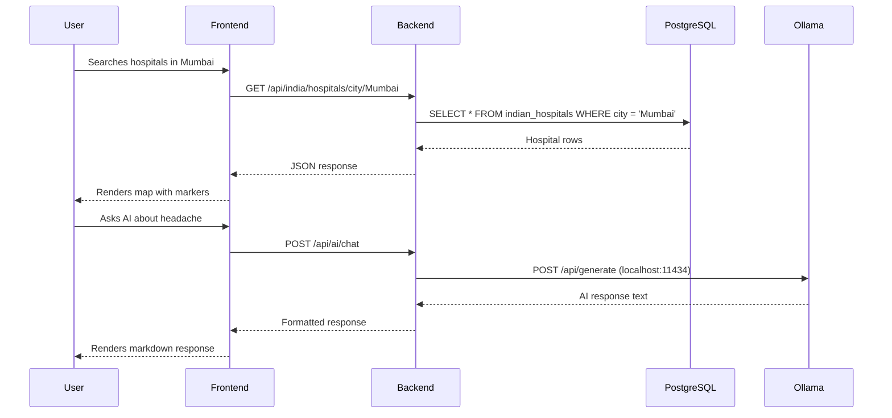

# Architecture

## Overview

Healthcare+ is a monorepo with three main parts: a React frontend, a Node.js/Express backend, and a PostgreSQL database. The AI assistant is handled by Ollama running locally on the user's machine.

## Folder Structure
HealthCare-PLUS/
├── frontend/          # React + TypeScript application
│   ├── src/
│   │   ├── pages/     # Route-level components
│   │   ├── components/# Reusable UI components
│   │   ├── context/   # React context (auth, chat, theme)
│   │   └── api/       # API client functions
├── backend/           # Node.js + Express server
│   ├── routes/        # Express route handlers
│   ├── middleware/    # Auth, error handling
│   ├── db/            # Database queries
│   └── scripts/       # Migration and seed scripts
└── package.json       # Root workspace config

## Request Flow

## Key Design Decisions

**Why Ollama instead of OpenAI?**
Medical queries are sensitive. Local inference means zero data leaves the user's machine. It also eliminates per-query API costs which would be prohibitive at scale.

**Why PostgreSQL instead of MongoDB?**
Hospital and doctor data has clear relational structure. Foreign keys enforce data integrity between appointments, doctors, and hospitals. PostgreSQL also handles Indian address data (pincodes, states) cleanly.

**Why React + TypeScript?**
The codebase has 50+ components. TypeScript catches prop type errors at compile time rather than at runtime in production. The repo is 86.6% TypeScript.

**Why Leaflet instead of Google Maps?**
Leaflet with OpenStreetMap is free with no API key required. Google Maps charges per map load which would not scale.
